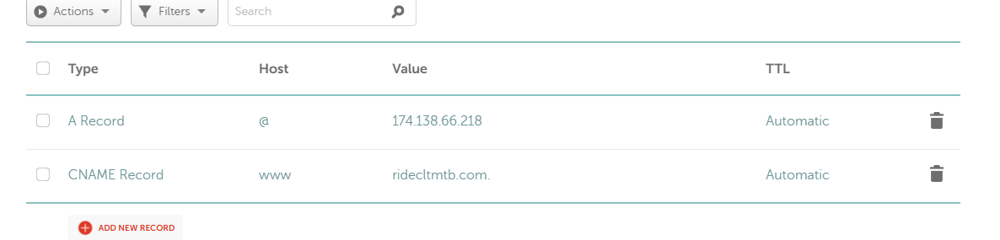

### Install dependences 

- Activate the venv

        source venv/bin/activate

 -Install everything at once

        pip install -r requirements.txt

### Troubleshoot & Restart Gunicorn Server

sudo systemctl stop ncmtb.service

- To Clear Image Cache

        (venv) root@DevelopWriterUmbrella:/var/www/site2/MTB_Master# rm -rf /var/www/site2/MTB_Master/media/CACHE

        
(venv) root@DevelopWriterUmbrella:/var/www/site2/MTB_Master# sudo systemctl start ncmtb.service

- Restart the app server (gunicorn)

        sudo systemctl restart ncmtb.service
    
    > gunicorn was renamed ncmtb.service

- Optional: Restart Nginx to clear any lingering gateway timeouts

        sudo systemctl restart nginx

ncmtb.service                                  loaded active running Gunicorn instance for NCMTB
site1.service                                  loaded active running Gunicorn for DevWriter

### Connect a URL (DNS) to a Preconfigured Digital Ocean Droplet (VM)

- Update the CNAME records in the Domain List where you purchased the URL

- Update Allowed_Hosts in Settings.py

- Update Nginx web server to handle traffic from the new URL:

                sudo nano /etc/nginx/sites-available/ncmtb

                server {
                listen 80;
                server_name charlottencmtb.com ridecltmtb.com www.ridecltmtb.com [new URL variations];
                ...
                }

- Test and Restart nginx and Gunicorn

                sudo nginx -t
                sudo systemctl restart nginx
                sudo systemctl restart ncmtb  # Restarts Gunicorn to pick up settings.py changes

- Generate a new SSL/HTTPS Certificate via Certbot

                sudo certbot --nginx -d charlottencmtb.com -d ridecltmtb.com -d www.ridecltmtb.com [new URL variations]